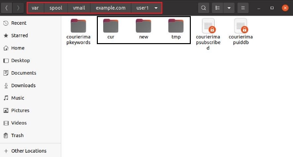
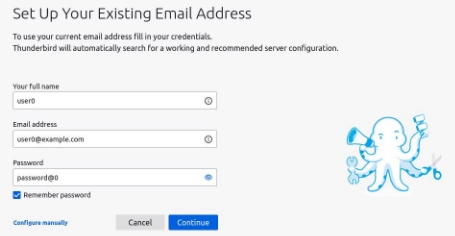
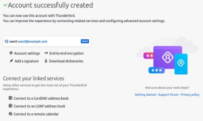
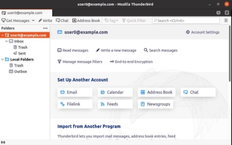
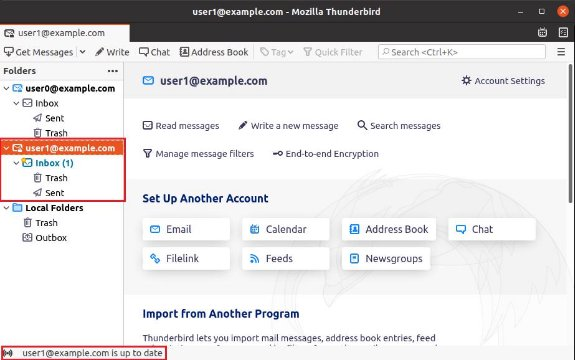
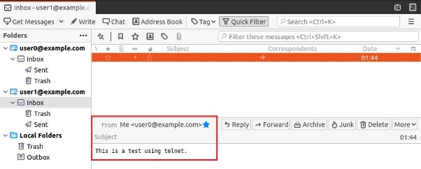

# postfix-Mail-Server
Mail Server
A Step-by-Step Guide To Set Up Postfix Mail Server 


Team Members: 

EL RHAZOUANI Zineb ELOBBI Anass ERROKHSSY Abdelatti   ERRAAD Adil  

KARTIT Hicham  YOUSSI Kenza  SAID EL OUARDI 

Major: Cyber Security 

**Index:** 

Introduction: What is Postfix and Courier Servers? 

Adding a mail server to the DNS 

Setting Up MySQL database 

Setting Up Postfix Server 

Install and configure courier-imap and courier-pop 

Test the configuration with the Thunderbird mail client and Telnet 

**Introduction:** 

A mail server (or email server) is a computer system that sends and receives email. In many cases, web servers and mail servers are combined in a single machine.  

Mail servers send and receive email using standard email protocols. For example, the SMTP (Simple Mail Transfer Protocol) protocol handles any outgoing mail requests and sends. The IMAP and POP3 protocols receive messages and are used to process incoming mail. When you log on to a mail server using a webmail interface or email client, these protocols handle all the connections behind the scenes. 

Postfix is a hugely-popular Mail Transfer Agent (MTA) designed to determine routes and send emails It attempts to be fast and secure, with flexibility in administration, while The *Courier* mail transfer agent (MTA) is an integrated mail/groupware server based on open commodity protocols, such as ESMTP, IMAP, POP3, LDAP, SSL, and HTTP.  

**Adding a Mail Server to the DNS:** 

In order to start sending mail to the mail server, we need to edit the domain’s DNS records to define our mail server by adding a DNS record for our email server. This can be an **A** record pointing to the server server’s **IP** address (in our case **10.0.2.15**), then adding an **MX** record where the hostname/name is set to **@**, the mail server to **mail.example.com**, and the priority to **10**. 

The forward zone:

```bat
 
IN  MX  10  mail.example.com.
IN  A  10.0.2.15

```
 
- The reverse zone: 

```bat

15  IN  PTR  mail.example.com.

```

We should make sure that the **MX** Records are correctly Set: 

```bat

dig MX +short example.com

10 mail.example.com.

```

```bat

dig A +short mail.example.com 
10.0.2.15

```
**Setting Up MySQL database:** 


First, we will install the following packages: 

```bat

sudo apt-get install mysql-client mysql-server 

```

Then we are going to create a MySQL database and add two different tables: one for **virtual domains** (known as the authorized domains), and the second for **virtual users**. 

In order to have more flexibility to change the configuration, we will store the SQL queries in created files 

- First, we will create **create.sql** file where we are going to name the database **servermail,** and create a new user **mailuser**, specific for the mail authentication which we are going to give SELECT permission. 

```bat

CREATE DATABASE mailserver; 

CREATE USER 'mailuser'@'127.0.0.1' IDENTIFIED BY 'password';
GRANT SELECT ON mailserver.* TO 'mailuser'@'127.0.0.1'; FLUSH PRIVILEGES; 

```

- Second, we will create **virtual\_domains** and **virtual\_users** tables in a **postfix-mysql.sql** file: 

```bat

USE mailserver;

CREATE TABLE  virtual\_domains  (
	'id'   INT NOT NULL AUTO\_INCREMENT, 
	'name'  VARCHAR(50) NOT NULL,
	PRIMARY KEY ( id )
	) ENGINE=InnoDB DEFAULT CHARSET=utf8; 

	CREATE TABLE  virtual\_users  (
	'id'  INT NOT NULL AUTO\_INCREMENT,
	'domain_id'  INT NOT NULL,
	'email'  VARCHAR(120) NOT NULL,
	'clearpw' VARCHAR(106) NOT NULL, 
	'cryptpw'  VARCHAR(106) NOT NULL,
	'uid'  smallint(5) unsigned NOT NULL default '5000',
	'gid'  smallint(5) unsigned NOT NULL default '5000',
	'home'  varchar(255) NOT NULL default '/var/spool/vmail/',
   	'maildir'  varchar(255) NOT NULL,
	PRIMARY KEY  ( id ),
	UNIQUE KEY  email  ( email ), 
	FOREIGN KEY (domain_id) REFERENCES virtual_domains(id) ON DELETE CASCADE ) ENGINE=InnoDB DEFAULT CHARSET=utf8; 

```

- **uid**: a uid (user identifier) is a number assigned by Linux to each user on the system. This number is used to identify the user to the system and to determine which system resources the user can access (uid 0 (zero) is reserved for the root). In our case is the user that will manage the mail folders and having more control. 
- **gid:** In Linux, a group is a collection of users. The main purpose of the groups is to define a set of privileges like read, write, or execute permission for a given resource that can be shared among the users within the group. 
- **home:** is the where the folder that contains the mail service data(emails) is located (the path). 
- **maildir:** is define the folder that contains that contains emails.**  
- Then we will create a **insert.sql** file to add some records to our tables: 


```bat

USE mailserver;
INSERT INTO  virtual_domains  ( name ) VALUES ('example.com');
INSERT INTO  virtual_users ( domain_id , email ,  clearpw ,  cryptpw , maildir ) VALUES ('1','user0@example.com','password@0',SHA2('password@0', CONCAT('$5$', MD5(RAND()))),CONCAT(SUBSTRING_INDEX(email,'@',- 1),'/',SUBSTRING_INDEX(email,'@',1),'/')); 

INSERT INTO  virtual_users ( domain_id , email ,  clearpw ,  cryptpw , maildir ) VALUES ('1','user1@example.com','password@1',SHA2('password@1', CONCAT('$5$', MD5(RAND()))),CONCAT(SUBSTRING_INDEX(email,'@',- 1),'/',SUBSTRING_INDEX(email,'@',1),'/'));** 

```

Now, we need to import the database configuration. 

```bat

sudo mysql -u root -p < create.sql

```

```bat

sudo mysql -u root -p < postfix-mysql.sql sudo mysql -u root -p < insert.sql

```

To enable MySQL logging for troubleshooting Postfix setup we need to uncomment the two lines in **/etc/mysql/mysql.conf.d/mysqld.cnf:** 

```bat

general\_log\_file        = /var/log/mysql/query.log 
general_log             = 1 

```

Now we restart MySQL:

```bat

 /etc/init.d/mysql restart

```

**Setting Up Postfix Server:** 

We are going to configure Postfix to handle the SMTP connections and send the messages for each user introduced in the MySQL Database. 

Installing the needed packages (we will ignore the graphical configuration when will be asked): 

```bat

sudo apt-get install postfix postfix-mysql 

```

we will set up the folder for where the emails will be stored: 

```bat

cp /etc/aliases /etc/postfix/aliases
 
```

```bat

mkdir /var/spool/vmail
groupadd vmail -g 5000
useradd vmail -u 5000 -g 5000
chown -R vmail: vmail /var/spool/vmail

```

Now, we will create the following files to access the lookups via the database: 

- The first file **/etc/postfix/mysql-virtual-mailbox-domains.cf:** 

```bat

hosts = 127.0.0.1

dbname=mailserver 

user=mailuser 

password=password 

query = SELECT name FROM virtual_domains WHERE name='%s' 

```

- The second file **/etc/postfix/mysql-virtual-mailbox-maps.cf:** 


```bat

hosts = 127.0.0.1

dbname=mailserver 

user=mailuser 

password=password

query = SELECT maildir FROM virtual_users WHERE email='%s' 


```

The following commands prevents the non-authorized users from reading Postfix files which contain MySQL credentials: 

```bat

sudo chown root:postfix /etc/postfix/mysql-virtual-mailbox 
sudo chmod 0640 /etc/postfix/mysql-virtual-mailbox

```

We need to create a copy of the default file in case we want to revert to the default configuration: 

```bat

sudo mv /etc/postfix/main.cf /etc/postfix/main.cf.orig

```

In the **/etc/postfix** create a **main.cf** file and paste this configuration: 


```bat

smtpd_banner = $myhostname ESMTP $mail_name
biff = no
relayhost = 
inet_interfaces = all
mynetworks_style = host
inet_protocols = ipv4
append_dot_mydomain = no
delay_warning_time = 4h
readme_directory = no
smtpd_tls_cert_file=/etc/ssl/certs/ssl-cert-snakeoil.pem
smtpd_tls_key_file=/etc/ssl/private/ssl-cert-snakeoil.key
smtpd_use_tls=yes
smtpd_tls_session_cache_database = btree:${data_directory}/smtpd_scache
smtp_tls_session_cache_database = btree:${data_directory}/smtp_scache
smtpd_relay_restrictions = permit_mynetworks permit_sasl_authenticated defer_unauth_destination
alias_maps = hash:/etc/postfix/aliases
alias_database = hash:/etc/postfix/aliases
virtual_mailbox_base = /var/spool/vmail
virtual_mailbox_maps = mysql:/etc/postfix/mysql-virtual-mailbox-maps.cf
virtual_mailbox_domains = mysql:/etc/postfix/mysql-virtual-mailbox-domains.cf

virtual_uid_maps = static:5000
virtual_gid_maps = static:5000


# Will be using virtual domains
local\_recipient\_maps =
mydestination =

mynetworks = 127.0.0.0/8 [::ffff:127.0.0.0]/104 [::1]/128
mailbox_size_limit = 0
recipient\_delimiter = +
# will it be a permanent error or temporary
unknown_local_recipient_reject_code = 450
# how long to keep message on queue before return as failed.
# some have 3 days, I have 16 days as I am backup server for some people
# whom go on holiday with their server switched off.
maximal_queue_lifetime = 7d
# max and min time in seconds between retries if connection failed
minimal_backoff_time = 1000s
maximal_backoff_time = 8000s
# how long to wait when servers connect before receiving rest of data
smtp_helo_timeout = 60s
# how many address can be used in one message.
# effective stopper to mass spammers, accidental copy in whole address list
# but may restrict intentional mail shots.|
smtpd_recipient_limit = 10
# how many error before back off.
smtpd_soft_error_limit = 3
# how many max errors before blocking it.
smtpd_hard_error_limit = 12

# Requirements for the HELO statement
smtpd_helo_restrictions = permit_mynetworks, warn_if_reject reject_non_fqdn_hostname, reject_invalid_hostname, permit
# Requirements for the sender details
smtpd_sender_restrictions = permit_mynetworks, warn_if_reject reject_non_fqdn_sender,reject_unknown_sender_domain, reject_unauth_pipelining, permit
# **Requirements for the connecting server**  

smtpd_client_restrictions = reject_rbl_client sbl.spamhaus.org, reject_rbl_client blackholes.easynet.nl

# **Requirement for the recipient address** 

smtpd_recipient_restrictions = reject_unauth_pipelining, permit_mynetworks, reject_non_fqdn_recipient, reject_unknown_recipient_domain, reject_unauth_destination,permit

smtpd_data_restrictions = reject_unauth_pipelining 

# require proper helo at connections  
smtpd_helo_required = yes 
# **waste spammers time before rejecting them 
smtpd_delay_reject = yes disable_vrfy_command = yes 

```


Now, we need to restart Postfix: 

```bat

sudo service postfix restart

```

We need to ensure that Postfix finds our domain, so we need to test it with the following command. If it is successful, it should return **example.com**:  

```bat

sudo postmap -q example.com mysql:/etc/postfix/mysql-virtual-mailbox- domains.cf

```

At this moment we are going to ensure Postfix finds our first email address with the following command. It should return **example.com/user0/** (which is the user0 mail directory that contains inbox sent folders…) if it's successful: 

```bat

sudo postmap -q user0@example.com mysql:/etc/postfix/mysql-virtual-mailbox- maps.cf

```

**Install and configure courier-imap and courier-pop as MDA:** 

Install the following packages: 

```bat

sudo apt-get install courier-base courier-authdaemon courier-authlib-mysql courier-imap

```

In order to make Courier IMAP to listen on IPv4 only, we need to change in **/etc/courier/imapd** the following: 

```bat

ADDRESS=0

```

To 

```bat

ADDRESS=0.0.0.0

```

And we should check if the **/etc/courier/authdaemonrc** file looks like: 

```bat

authmodulelist="authmysql" 

authmodulelistorig="authuserdb authpam authpgsql authldap authmysql authcustom authpipe"

daemons=5 

authdaemonvar=/var/run/courier/authdaemon

DEBUG_LOGIN=2 

DEFAULTOPTIONS="" 

LOGGEROPTS=""

```

We will edit the **/etc/courier/authmysqlrc** which used to connect to the MySQL database for the virtual users’ credentials: 

We can use the following command to see the configuration (it helps to see uncomment lines): 


```bat

sudo grep -ve "^#" -ve "^$" /etc/courier/authmysqlrc 

```

```bat

MYSQL_SERVER    127.0.0.1
MYSQL_USERNAME mailuser
MYSQL_PASSWORD   password
MYSQL_PORT   0
MYSQL_OPT   0
MYSQL_DATABASE   mailserver
MYSQL_USER_TABLE   virtual_users
MYSQL_CLEAR_PWFIELD  clearpw
MYSQL_UID_FIELD   uid
MYSQL_GID_FIELD   gid
MYSQL_LOGIN_FIELD   email
MYSQL_HOME_FIELD   home 

MYSQL_MAILDIR_FIELD   maildir 


```

**Test the configuration with the Thunderbird mail client and Telnet:** 

In order to use Thunderbird mail client, we need to have mail directory that contains such as current, new folders so we will use Telnet utility to initialize and create the **new,** **tmp** and **cur** folders: 



So, as we mentioned in the above explanation, we will send an email from [**user0@example.com** ](mailto:user0@example.com)to[` `**user1@example.com** ](mailto:user1@example.com)as show below: 


Now after having a maildir architecture, we will use thunderbird as a mail client: 



If everting in correctly set upped we will get the following message:   



After that we will get in the **user0** mailspace: 

And if we logged into the **user1** account we will find the email that we already sent using Telnet. 



And finally: 


